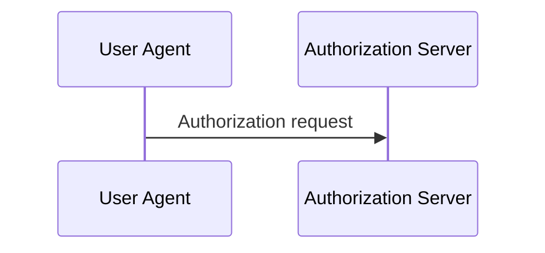
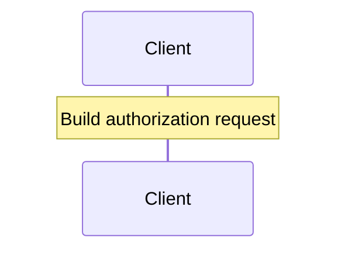

# 0005 - Sequence-diagrammable workflows

## Status

Proposed.

This note captures a metamodel issue discovered while trying to generate human-facing Mermaid diagrams from the existing QUIC and OAuth examples.

The current model can generate useful state-machine diagrams, but the workflow relationship diagrams are not useful enough as documentation.

That is not only a generator problem.

It reveals that the semantics of `Workflow.steps` are underspecified.

---

## Context

Current workflows use `steps` as an ordered list of capability references.

Example:

```yaml
roles:
  primary: client
  participants:
    - user_agent
    - authorization_server

steps:
  - oauth/build_authorization_request
  - oauth/redirect_to_authorization_server
  - oauth/receive_authorization_request
  - oauth/validate_redirect_uri
```

This tells us which capabilities are involved in the workflow.

It does not tell us:

- who sends something
- who receives something
- which role performs a local action
- what message should appear in a sequence diagram
- whether a capability represents an observable exchange or internal decomposition

A generator can draw `Workflow -> Capability`, but that is mostly an inspection view.

It does not produce a readable behavioral scenario.

---

## Problem

BehavioML workflows should describe behaviorally meaningful scenarios.

A behaviorally meaningful scenario should usually be renderable as a sequence diagram, at least when the workflow involves multiple roles.

The current `steps` shape is not enough for that.

Any sequence-diagram generator would have to guess role direction.

That is not acceptable.

For example:

```yaml
steps:
  - oauth/redirect_to_authorization_server
  - oauth/receive_authorization_request
```

A generator cannot reliably infer whether the observable exchange is:

```text
client -> user_agent
```

or:

```text
user_agent -> authorization_server
```

or whether the capability is purely local.

---

## Rejected direction: separate interactions list

One possible solution is to add a separate `interactions` section:

```yaml
steps:
  - oauth/build_authorization_request
  - oauth/redirect_to_authorization_server
  - oauth/receive_authorization_request

interactions:
  - from: client
    to: user_agent
    capability: oauth/redirect_to_authorization_server
    label: Redirect to authorization server

  - from: user_agent
    to: authorization_server
    capability: oauth/receive_authorization_request
    label: Authorization request
```

This is not the preferred direction.

It creates two ordered lists that can drift:

- `steps`
- `interactions`

It also duplicates capability references.

BehavioML should avoid maintaining two sources of truth for the same scenario spine.

---

## Proposed direction

Make `Workflow.steps` the ordered observable spine of the scenario.

A step remains anchored to one capability, but may also describe how that capability appears in the scenario.

A step can be either:

1. an interaction between roles
2. a local action at the current role

---

## Step shape

The current string form remains valid:

```yaml
steps:
  - oauth/build_authorization_request
```

It is equivalent to:

```yaml
steps:
  - capability: oauth/build_authorization_request
```

The object form allows sequence-diagram semantics:

```yaml
steps:
  - at: client
    capability: oauth/build_authorization_request
    label: Build authorization request

  - from: client
    to: user_agent
    capability: oauth/redirect_to_authorization_server
    label: Redirect to authorization server

  - from: user_agent
    to: authorization_server
    capability: oauth/receive_authorization_request
    label: Authorization request

  - capability: oauth/validate_redirect_uri
    label: Validate redirect URI

  - capability: oauth/issue_authorization_code
    label: Issue authorization code

  - from: authorization_server
    to: user_agent
    capability: oauth/redirect_with_authorization_code
    label: Redirect with authorization code
```

---

## Semantics

### Interaction step

A step with both `from` and `to` represents an observable exchange between roles.

```yaml
- from: user_agent
  to: authorization_server
  capability: oauth/receive_authorization_request
  label: Authorization request
```

This can render as:



### Local step with explicit role

A step with `at` represents a local action performed by one role.

```yaml
- at: client
  capability: oauth/build_authorization_request
  label: Build authorization request
```

This can render as:



### Local step with inferred role

A step without `from`, `to`, or `at` is a local action at the current role.

The current role is inferred from the previous step.

The current role is:

1. the `to` role of the previous interaction step
2. the `at` role of the previous local step
3. `roles.primary` if no current role exists yet

Example:

```yaml
steps:
  - from: user_agent
    to: authorization_server
    capability: oauth/receive_authorization_request
    label: Authorization request

  - capability: oauth/validate_redirect_uri
    label: Validate redirect URI

  - capability: oauth/issue_authorization_code
    label: Issue authorization code
```

This means:

```text
user_agent -> authorization_server: Authorization request
Note over authorization_server: Validate redirect URI
Note over authorization_server: Issue authorization code
```

This avoids repeating `at: authorization_server` on every local step.

---

## Why `label` is needed

`capability` and `label` are not the same thing.

`capability` is the stable model identity of the responsibility.

`label` is how the step is presented in this workflow.

A capability can be generic:

```yaml
capability: oauth/authenticate_resource_owner
```

while a workflow step can present it contextually:

```yaml
label: Re-authenticate user after session expiry
```

`label` should be optional, with a generator fallback based on the humanized capability identity.

However, labels are recommended for workflows intended to produce human-facing sequence diagrams.

---

## Capability decomposition remains separate

Workflow steps should not include every internal responsibility.

Internal decomposition belongs in `Capability.uses`.

For example, a high-level workflow step may be:

```yaml
- from: user_agent
  to: authorization_server
  capability: oauth/handle_authorization_request
  label: Authorization request
```

The capability may then decompose internally:

```yaml
uses:
  - oauth/validate_redirect_uri
  - oauth/authenticate_resource_owner
  - oauth/obtain_consent
  - oauth/issue_authorization_code
```

This keeps the workflow focused on the scenario spine while still allowing deeper capability structure.

---

## Design principle

`Workflow.steps` should be sequence-diagrammable.

That does not mean every step must be a message between roles.

It means every step should have a clear place in an observable scenario:

- as an interaction between roles
- as a local action by a role

If a capability cannot be meaningfully placed in the scenario sequence, it probably belongs in `Capability.uses` rather than directly in `Workflow.steps`.

---

## Validator implications

Future validator support should allow both legacy and object step forms.

Errors:

- object step must define `capability`
- `from` and `to` must appear together
- `from`, `to`, and `at` must reference roles in the workflow
- `from`/`to` and `at` should not be used on the same step
- `capability` must reference an existing capability

Warnings:

- workflow uses object steps but some steps lack `label`
- local step relies on inferred current role and no current role exists
- capability appears in a workflow step but is not behaviorally observable enough to render clearly, if such a heuristic can be defined later

Non-errors:

- step without `from`/`to`
- step without `label`
- string-form legacy step
- local step inferred from previous interaction target

---

## Generator implications

A future sequence view can be generated from workflow object steps.

Command shape could be:

```bash
behavioml-generate <model-dir> --format mermaid --view sequence --workflow <workflow-identity>
```

For each step:

- `from` + `to` renders as a Mermaid sequence message
- `at` renders as `Note over <role>`
- no `from`/`to`/`at` renders as `Note over <current-role>`
- `label` is used as message text
- missing `label` falls back to humanized capability identity

The generator should not guess role direction from capability names.

---

## Impact on existing examples

The QUIC and OAuth examples can remain valid using legacy string steps.

OAuth should be the first example converted experimentally because it has the clearest need for role-to-role sequence diagrams:

- resource owner
- client
- user agent
- authorization server
- resource server

If OAuth cannot be modeled cleanly with this shape, the proposal should be revised before updating validator or generator behavior.

---

## Open questions

1. Should object step form become the preferred form for all workflows, or only workflows intended for sequence diagrams?
2. Should `label` be optional or required for object steps?
3. Should `at` be required for local steps, or is current-role inference desirable enough to keep?
4. Should generators render local steps by default, or hide them unless explicitly requested?
5. Should `Capability.uses` be visualized separately to show internal decomposition below each sequence step?
6. Should workflows eventually distinguish documentation-level steps from deeper behavioral steps?
7. Should `triggered_by` be shown in sequence diagrams as an incoming event marker?

---

## Current position

The current `Workflow.steps` string form remains valid.

The proposed object step form should be explored first in the OAuth example before changing validator or generator rules.

Do not add a separate `interactions` list.

Do not add inline branching, conditions, loops, `alt`, `opt`, or executable workflow logic.

Do not infer role-to-role messages from capability names.
