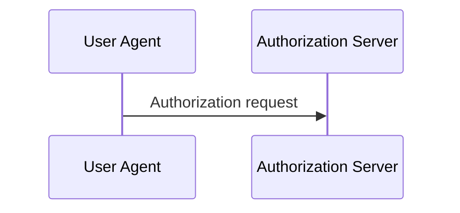
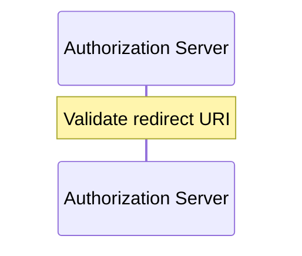
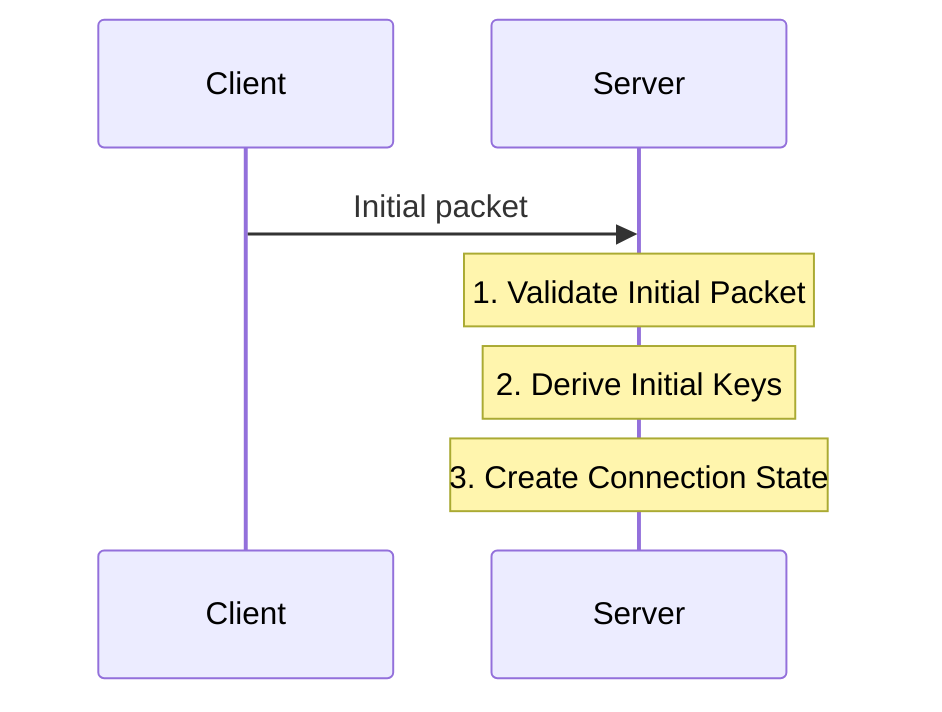

# 0005 - Sequence-diagrammable workflows

## Status

Proposed.

This note captures a metamodel issue discovered while trying to generate human-facing Mermaid diagrams from the QUIC and OAuth examples.

State-machine diagrams were already useful, but early workflow relationship diagrams were mostly inspection views rather than readable behavioral documentation.

That revealed two related issues:

1. `Workflow.steps` needed explicit role context to be sequence-diagrammable.
2. The boundary between `Workflow.steps` and `Capability.uses` needed clearer semantics for documentation and code generation.

---

## Context

Early workflows used `steps` as an ordered list of capability references.

Example:

```yaml
roles:
  primary: client
  participants:
    - user_agent
    - authorization_server

steps:
  - oauth/build_authorization_request
  - oauth/redirect_to_authorization_server
  - oauth/receive_authorization_request
  - oauth/validate_redirect_uri
```

This tells us which capabilities are involved in the workflow.

It does not tell us:

- who sends something
- who receives something
- which role performs a local action
- what message should appear in a sequence diagram
- whether a capability represents an observable exchange or internal decomposition

A generator can draw `Workflow -> Capability`, but that is mostly an inspection view.

It does not produce a readable behavioral scenario.

---

## Problem

BehavioML workflows should describe behaviorally meaningful scenarios.

A behaviorally meaningful scenario should usually be renderable as a sequence diagram, at least when the workflow involves multiple roles.

A sequence-diagram generator must not guess role direction.

For example:

```yaml
steps:
  - oauth/redirect_to_authorization_server
  - oauth/receive_authorization_request
```

A generator cannot reliably infer whether the observable exchange is:

```text
client -> user_agent
```

or:

```text
user_agent -> authorization_server
```

or whether the capability is purely local.

At the same time, workflows should not become overly atomic lists of every helper, validation, lookup, transformation, or state update.

That detail belongs in capability decomposition when the parent capability provides enough execution context.

---

## Rejected direction: separate interactions list

One possible solution is to add a separate `interactions` section:

```yaml
steps:
  - oauth/build_authorization_request
  - oauth/redirect_to_authorization_server
  - oauth/receive_authorization_request

interactions:
  - from: client
    to: user_agent
    capability: oauth/redirect_to_authorization_server
    label: Redirect to authorization server

  - from: user_agent
    to: authorization_server
    capability: oauth/receive_authorization_request
    label: Authorization request
```

This is not the preferred direction.

It creates two ordered lists that can drift:

- `steps`
- `interactions`

It also duplicates capability references.

BehavioML should avoid maintaining two sources of truth for the same scenario spine.

---

## Rejected direction: implicit current role

Another possible solution is to let local steps omit role context and inherit the previous receiver.

Example:

```yaml
steps:
  - from: user_agent
    to: authorization_server
    capability: oauth/receive_authorization_request
    label: Authorization request

  - capability: oauth/validate_redirect_uri
    label: Validate redirect URI

  - capability: oauth/issue_authorization_code
    label: Issue authorization code
```

This is concise, but it creates fragile implicit state.

If a visual editor moves or deletes the first step, the meaning of the following local steps changes.

BehavioML should support visual editing and stable local transformations.

For that reason, object steps should not rely on implicit current-role inference.

---

## Proposed direction

Make `Workflow.steps` the ordered scenario spine.

A step remains anchored to one capability, but may also describe how that capability appears in the scenario.

A step can be either:

1. an interaction between roles
2. a local action performed by one role

Both forms are explicit.

Object steps require `from`.

`to` is optional.

---

## Step shape

The string form remains valid:

```yaml
steps:
  - oauth/build_authorization_request
```

It is equivalent to a legacy compact capability reference.

It is valid, but it is not sequence-diagrammable without additional information.

The object form allows sequence-diagram semantics:

```yaml
steps:
  - from: client
    capability: oauth/build_authorization_request
    label: Build authorization request

  - from: client
    to: user_agent
    capability: oauth/redirect_to_authorization_server
    label: Redirect to authorization server

  - from: user_agent
    to: authorization_server
    capability: oauth/receive_authorization_request
    label: Authorization request

  - from: authorization_server
    capability: oauth/validate_redirect_uri
    label: Validate redirect URI

  - from: authorization_server
    capability: oauth/issue_authorization_code
    label: Issue authorization code

  - from: authorization_server
    to: user_agent
    capability: oauth/redirect_with_authorization_code
    label: Redirect with authorization code
```

---

## Semantics

### Interaction step

A step with both `from` and `to` represents an observable exchange between roles.

```yaml
- from: user_agent
  to: authorization_server
  capability: oauth/receive_authorization_request
  label: Authorization request
```

This can render as:



### Local step

A step with `from` and no `to` represents a local action performed by one role.

```yaml
- from: authorization_server
  capability: oauth/validate_redirect_uri
  label: Validate redirect URI
```

This can render as:



There is no separate `at` field.

`from` means the role responsible for the step.

`to` means the step crosses a role boundary.

---

## Why `label` is needed

`capability` and `label` are not the same thing.

`capability` is the stable model identity of the responsibility.

`label` is how the step is presented in this workflow.

A capability can be generic:

```yaml
capability: oauth/authenticate_resource_owner
```

while a workflow step can present it contextually:

```yaml
label: Re-authenticate user after session expiry
```

`label` should be optional, with a generator fallback based on the humanized capability identity.

However, labels are recommended for workflows intended to produce human-facing sequence diagrams.

---

## Capability decomposition remains separate but ordered

Workflow steps should not include every internal responsibility.

Internal decomposition belongs in `Capability.uses` when the parent capability and its workflow-step context make the sub-capabilities unambiguous.

`Capability.uses` is ordered.

The order of entries is meaningful and represents ordered decomposition within the execution context of the parent capability.

For example, a high-level workflow step may be:

```yaml
- from: user_agent
  to: authorization_server
  capability: oauth/handle_authorization_request
  label: Authorization request
```

The capability may then decompose internally:

```yaml
uses:
  - oauth/validate_redirect_uri
  - oauth/authenticate_resource_owner
  - oauth/obtain_consent
  - oauth/issue_authorization_code
```

This means that `handle_authorization_request` is decomposed into those sub-capabilities in that order, under the execution context supplied by the parent workflow step.

It does not mean that each used capability is a new role-to-role message.

It also does not model branching, loops, retries, concurrency, exception handling, data flow, transaction boundaries, or runtime scheduling.

---

## When to use Workflow.steps versus Capability.uses

Use `Workflow.steps` when the model must explain who does what with whom.

A capability should usually be a workflow step when:

- it is needed to understand the scenario sequence
- it changes which role is acting or receiving
- it is an observable exchange between roles
- it is a local action important enough to appear in the top-level scenario
- it sends, receives, redirects, publishes, or delivers something across a role boundary
- it represents a callback, webhook, broker delivery, protocol exchange, retry, or externally meaningful follow-up
- it produces an event that triggers another workflow or state transition relevant to the scenario

Use `Capability.uses` when the parent capability already provides enough execution context.

A capability should usually move to `Capability.uses` when:

- it is internal validation, preparation, persistence, lookup, or transformation
- it is a helper or sub-responsibility of a higher-level capability
- it belongs naturally inside the parent implementation boundary
- a generator can place it correctly using the parent capability plus the parent workflow-step context
- it does not need its own sender, receiver, or observable role interaction

Do not use `Capability.uses` to hide role interactions.

If a sub-capability needs its own sender, receiver, observable message, callback, protocol exchange, externally meaningful local action, or role ownership that is not clear from the parent context, it should be represented as a workflow step instead.

This boundary is modeling judgment, but it is not arbitrary:

```text
Workflow.steps answer: who does what with whom?
Capability.uses answers: what ordered sub-responsibilities happen inside this capability?
```

---

## Explicit interactions only

Generators must not infer omitted interactions.

If a protocol, runtime, browser, broker, or environment implies a follow-up exchange, that exchange must still be modeled as an explicit workflow step when it is relevant to the scenario.

For example, an OAuth authorization server redirect can be modeled as:

```yaml
- from: authorization_server
  to: user_agent
  capability: oauth/redirect_with_authorization_code
  label: Redirect with authorization code
```

A generator must not automatically invent the browser callback:

```text
user_agent -> client: Authorization callback
```

If the callback is relevant, the workflow should model it explicitly:

```yaml
- from: user_agent
  to: client
  capability: oauth/deliver_authorization_callback
  label: Authorization callback
```

This keeps the model as the source of truth.

The same rule applies to webhooks, message-broker deliveries, retries, redirects, async notifications, and protocol-specific follow-up exchanges.

---

## Response production versus response delivery

A capability may produce a result without modeling the delivery of that result across a role boundary.

For example:

```yaml
- from: authorization_server
  capability: oauth/issue_access_token
  label: Issue access token
```

This models token issuance as local work by the authorization server.

It does not necessarily model a token response being sent to the client.

If response delivery matters to the scenario, model it explicitly:

```yaml
- from: authorization_server
  to: client
  capability: oauth/return_token_response
  label: Token response
```

Alternatively, a higher-level capability can represent the observable response and decompose internally:

```yaml
- from: authorization_server
  to: client
  capability: oauth/issue_tokens_response
  label: Token response
```

with:

```yaml
uses:
  - oauth/validate_authorization_code
  - oauth/issue_access_token
  - oauth/issue_refresh_token
```

This avoids confusing internal production with observable delivery.

The top-level workflow step owns the role boundary.

The used capabilities describe ordered internal work needed to produce that response.

---

## Code generation implications

A code generator may use `Capability.uses` to scaffold internal execution structure.

For example:

```text
handle_authorization_request
├─ validate_redirect_uri
├─ authenticate_resource_owner
├─ obtain_consent
└─ issue_authorization_code
```

The order is meaningful.

A generator may use that order to create handler skeletons, helper calls, TODOs, tests, or execution outlines.

However, `Capability.uses` alone does not provide complete implementation semantics.

It does not specify:

- input and output data mapping
- error propagation
- conditional branches
- retry policy
- transaction scope
- async scheduling
- persistence schema
- wire protocol details

Those details may be supplied by implementation guidance, technical contracts, or handwritten code.

The important constraint is that code generators must not invent missing behavior.

If a used capability requires context that cannot be derived from the parent capability and workflow step, that is a modeling gap, not a codegen opportunity.

---

## Generator implications

A sequence view can be generated from workflow object steps.

A minimal sequence generator should render only `Workflow.steps`.

A richer sequence generator may optionally expand `Capability.uses`.

Expanded uses should be rendered as ordered internal decomposition inside the parent workflow-step context.

For example:

```yaml
- from: client
  to: server
  capability: quic/receive_initial_packet
  label: Initial packet
```

with:

```yaml
uses:
  - quic/validate_initial_packet
  - quic/derive_initial_keys
  - quic/create_connection_state
```

may render as:



The placement of expanded uses is a rendering convention:

- for `from + to` parent steps, show used capabilities over the `to` role
- for `from`-only parent steps, show used capabilities over the `from` role

This convention does not give `Capability.uses` independent role-interaction semantics.

Used capabilities must not be rendered as additional role-to-role messages unless they are also explicit workflow steps.

Generators must not infer callbacks, omitted messages, role direction, branches, or retries from capability names.

---

## Design principle

`Workflow.steps` should be sequence-diagrammable.

That does not mean every step must be a message between roles.

It means every object step should have a clear place in a behavioral scenario:

- as an interaction between roles
- as a local action by a role

`Capability.uses` should be ordered and useful for deeper documentation and code-generation scaffolding.

However, a used capability should only live in `uses` when the parent context is sufficient for a generator or implementer to understand where it belongs.

If a capability cannot be placed unambiguously inside the parent context, it probably belongs in `Workflow.steps`.

---

## Validator implications

Future validator support should allow both legacy string steps and object steps.

Errors for object steps:

- object step must define `capability`
- object step must define `from`
- `to` must not appear without `from`
- `from` and `to` must reference roles in the workflow
- `from` and `to` should not be the same role unless explicitly allowed later
- `capability` must reference an existing capability
- `at` is not a valid workflow step field

Additional structural checks for `Capability.uses`:

- each used capability must reference an existing capability
- the order of `uses` entries must be preserved by parsers and generators
- duplicate uses may be warned about if they are likely accidental
- recursive uses cycles should be detected by tools that expand uses recursively

Warnings:

- workflow uses object steps but some steps lack `label`
- workflow mixes legacy string steps and object steps
- workflow uses only legacy string steps and therefore cannot produce reliable sequence diagrams
- capability appears in a workflow step but is not behaviorally observable enough to render clearly, if such a heuristic can be defined later
- capability `uses` appears to hide an interaction, if such a heuristic can be defined later

Non-errors:

- step without `to`
- step without `label`
- string-form legacy step
- capability with no `uses`

---

## Current position

Keep workflows readable and role-aware.

Keep capabilities useful and ordered.

Use:

```text
Workflow.steps  = ordered scenario spine with explicit role context
Capability.uses = ordered internal decomposition under the parent capability context
```

Do not add workflow control flow.

Do not add UML-style activity semantics.

Do not use `Capability.uses` to hide interactions.

Do not require implementation details in the behavior model.

Use implementation guidance and technical contracts for details that are necessary for production code but are not behavior-first model facts.
